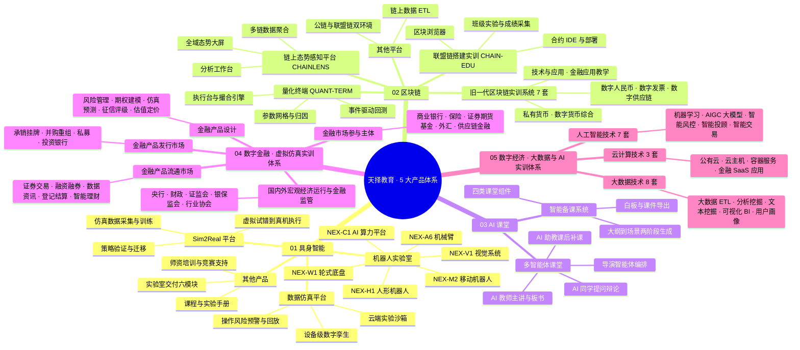
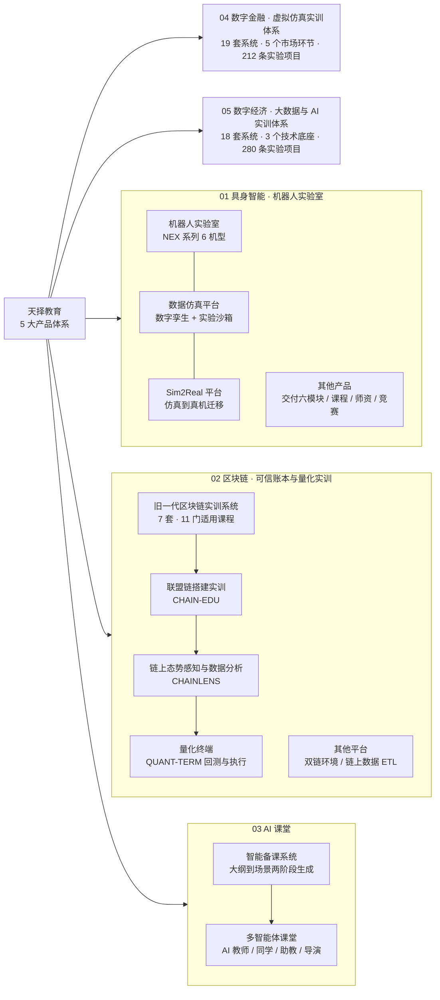
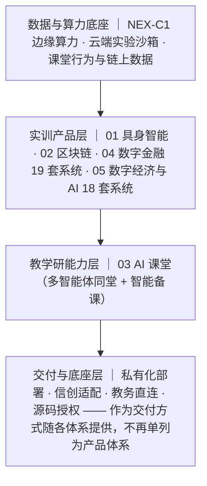

# 天择教育 · 5 大产品体系结构图

> 口径来源：`src/data/site.js`（`productMatrix` / `embodiedProducts` / `blockchainProducts` / `labModules`）。
> 本文为**产品结构（思维导图 + 分层结构图 + 明细表）**，不改动站点代码；改产品时三处需同步。
> 04 / 05 两条由旧平台「智云经济金融虚拟仿真平台」迁入，系统数与技术分类以平台接口原文为准
> （采集件：`tmp/audit/oldplat-apps.json`，只读采集，字段里的凭据已洗掉）。

## 一、思维导图（Mermaid mindmap）

需要 Mermaid v9.4+（GitHub / Typora / VS Code Mermaid 插件 / mermaid.live 均可渲染）。

## 二、结构图（体系 → 子产品，横向）

## 三、分层结构图（同一批产品的另一种切法）

## 四、明细表

### 01 具身智能 · 机器人实验室

| 子产品 | 定位 | 关键能力 / 参数 |
| --- | --- | --- |
| 机器人实验室 | 成套硬件 + 实验管理平台 | NEX-H1 人形（24 DOF）、NEX-A6 机械臂（±0.05mm）、NEX-M2 移动（激光 SLAM）、NEX-W1 轮式底盘、NEX-V1 视觉（RGB-D）、NEX-C1 算力（120 TOPS） |
| 数据仿真平台 | 设备级数字孪生与云端沙箱 | 1:1 孪生、操作风险预警、实训过程回放 |
| Sim2Real 平台 | 仿真到真机的训练与迁移 | 虚拟试错 → 真机执行、仿真数据采集与策略验证 |
| 其他产品 | 整lab交付配套 | 空间规划、硬件设备、软件平台、课程体系、师资培训、竞赛支持 |

指标：落地实验室 200+ ｜ 课时课程 320+

### 02 区块链 · 可信账本与量化实训

| 子产品 | 代号 | 定位 | 关键参数 |
| --- | --- | --- | --- |
| 联盟链搭建实训 | CHAIN-EDU | 真实联盟链上写合约、部署、发交易 | 6 共识节点 ｜ 33 份合约 ｜ 134 笔交易 ｜ 校内私有化 |
| 数据分析平台（链上态势感知） | CHAINLENS | 多链区块/交易/合约调用聚合与大屏 | 10 条公链 ｜ 933 组日度聚合 ｜ 百万级明细 ｜ 小时级更新 |
| 量化仿真平台（量化终端） | QUANT-TERM | 事件驱动回测 + 执行台，同一内核 | 8.4 年历史深度 ｜ 3,240 组参数网格 ｜ 下单延迟 ≤ 6ms |
| 其他平台 | — | 双链环境与链上数据 ETL 延伸 | 待规划 |
| 旧一代区块链实训系统 | — | 旧平台 7 套系统的实验资产收纳进本体系 | 7 套系统 ｜ 8 个适用专业 ｜ 11 门适用课程 ｜ 其中 4 套标了学时共 32 学时 |

### 03 AI 课堂

| 子产品 | 定位 | 关键能力 |
| --- | --- | --- |
| 多智能体课堂 | AI 教师与同学同堂互动 | 四类课堂组件（讲解幻灯 / 随堂提问 / 互动模拟 / 项目任务）、白板实时书写、语音与课件导出、模型可换数据不出校；生成一堂课 ≤ 40s |
| 智能备课系统 | 一句话生成一堂课 | 主题 → 教学大纲 → 课堂场景两阶段生成，组件按堂排布 |

### 04 ~ 05 独立产品体系

| 编号 | 产品 | 一句话定位 | 关键能力 | 指标 |
| --- | --- | --- | --- | --- |
| 04 | 数字金融 · 虚拟仿真实训体系 | 按金融市场真实链路排实验 | 宏观监管 / 产品设计 / 发行市场 / 流通市场 / 参与主体 五个环节，19 套系统各带实验项目清单 | 实训系统 19 套 ｜ 实验项目 212 条 ｜ 适用课程 58 门 ｜ 覆盖 25 专业 |
| 05 | 数字经济 · 大数据与 AI 实训体系 | 三个技术底座 18 套系统直接开课 | 大数据 ETL 与分析挖掘、机器学习与 AIGC 大模型、智能风控·投顾·交易、云主机与金融 SaaS | 实训系统 18 套 ｜ 实验项目 280 条 ｜ 适用课程 47 门 ｜ 覆盖 25 专业 |

## 五、维护约定

- 子产品名称以 `src/data/site.js` 为准：具身智能取 `embodiedProducts` + `labModules`，区块链取 `blockchainProducts` 的 `name`/`code`，其余取 `productMatrix` 的 `title`。
- 新增/重命名产品时：先改 `site.js`，再回本文件同步 mindmap、结构图、明细表三处（三处节点必须一致）。
- 04 / 05 的系统名、技术分类、适用专业与课程**不得由我们自己归纳**，以旧平台接口原文为准；要补数字就重跑只读采集脚本 `tmp/oldplat-apps.mjs`，不要靠记得。
- 清单屏那 25 枚图形入口是 `src/components/sections/SystemGlyphs.jsx` 里自绘的标记，映射表在 `tmp/gen-legacy-systems.mjs`（宽词排后面 + 同桶第 3 次起走邻桶）；改产品名后重跑生成器，再拿 `tmp/glyph-ledger.mjs` 查有没有撞脸。
- Mermaid 节点文本内**不要出现半角括号与方括号**，需要时用全角 `（）` 或 `·`，否则 mindmap 会把它们当形状定界符解析失败。
